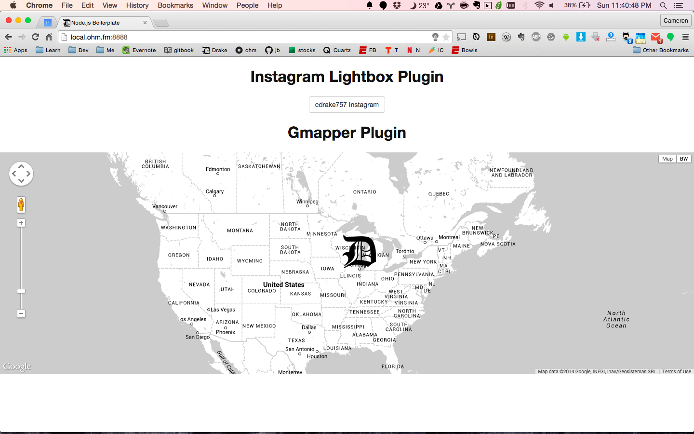

# Ohm Plugins


## Instagram Lightbox Plugin 
For a long time I have wanted to develop my own lightbox for my photography and I am very excited to share this plugin as a part of this repo. I am trying to make utilizing this plugin as easy as possible within any express app, but I have only tested it with ohm so far so my apologies if you have trouble integrating it into your project.
The plugin uses  the [instagram-node](https://github.com/totemstech/instagram-node) module to authenticate instagram and retrieve instagram photos for a user or for a feed. Using the repo requires a few main components:

* Lightbox Controller
* Lightbox Routes
* Lightbox Client
* Instagram API config

To get started you need to include the Routes and Controllers into your main app like so<sup>[1](https://github.com/ohmlabs/ohm/blob/master/ohm.coffee#L25)</sup>:
```js
lightbox = require("./server/routes/lightbox.js")
```
Then apply that them to the app<sup>[2](https://github.com/ohmlabs/ohm/blob/master/ohm.coffee#L56)</sup>:
```js
lightbox(parentApp)
```
Next you need to be sure that the required styles are imported into your main sass file<sup>[3](https://github.com/ohmlabs/ohm/blob/master/client/sass/style.sass#L9)</sup>:
```sass
@import "ui/lightbox"
```
Make sure that the client-side file is included<sup>[4](https://github.com/ohmlabs/ohm/blob/master/server/views/sample.jade#L48)</sup> and finally initialize the client<sup>[5](https://github.com/ohmlabs/ohm/blob/master/client/js/ohm.js#L17)</sup>:
```js
var lightbox = new LightBox();
```

The plugin will not work until you have added credentials from Instagram, which you can retrieve [here](http://instagram.com/developer/clients/manage/) and then update your config [here](https://github.com/ohmlabs/ohm/blob/master/server/config/config.example.js#L12) and [here](https://github.com/ohmlabs/ohm/blob/master/server/config/config.example.js#L21). With your app running you can you will need to authenticate before you can like photos by navigating to ```/authorize_user``` (mind your redirect url must match what you provided to the IG site).
After everything is configured using the plugin is very easy, just add the following markup to look up a users photos: 
```html
<a class="lb-instagram" data-user="777777">Show Photos</a>
```
And this code will retrieve your instagram feed:
```html
<button id="lb-instagram-feed" class="btn btn-primary">Instagram Feed</button>
```
