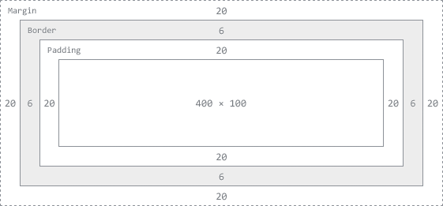
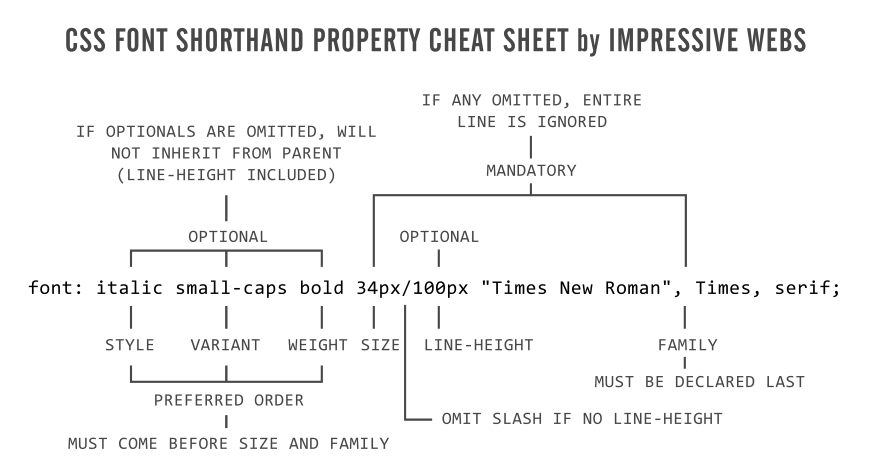
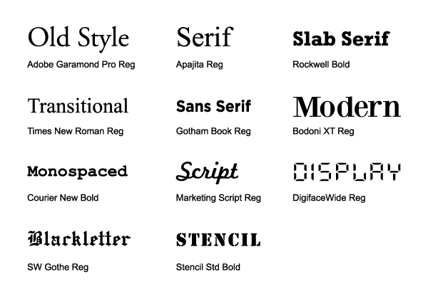

# [Frontend Designer Boilerplate](readme.md)
## Abstract
This guide is not designed for absolute novice web developer. Therefore, I thought it would be helpful to provide some references for those people. I recommend starting with the section "For Absolute Beginners" if you are completely new to web development, especially [these videos](http://www.dontfeartheinternet.com/). They are stylish introductions to the concepts that you will need to be a web developer. You may also want to complete the W3C tutorials and grab a copy of any of the books listed in the additional materials section and peruse it at your leisure. That being said, the best way is to simply dive in and build your own site.
## Contents
* [Introduction](#introduction)
* [Git](#github)
  + [Designer's Guide to Github](git.md) 
* [CSS3](#css3)
  + [CSS Style Guide](css/readme.md)
* [HTML5](#html5)
* [Javascript](#javascript)
  + [JavaScript Style Guide](js-styleguide.md)
* [Server Administration](#server-side-development)
  + [Designer's Guide to AWS](aws.md)
* [Performance/Support](#browser-support)
  + [Rules to High Performing Websites](performance.md)
* [References](#references)

#### Download Your Favorite Text Editor
Chances are your server comes with a few text editors installed (generally vi, nano etc.), but if you're like me and you love emacs you'll need to sudo install emacs to make your life easier. 
 
#### Customize Your Shell
Most linux machines use bash as the default shell, and if you've been using linux long enough it's likely that you have amassed an impressively large .bashrc (or .zshrc if you like me prefer the zsh shell) filled with aliases and enhancements to your shell environment. If you don't know what a .bashrc is then you should take the time to research how these files work and how they can make your life a lot easier. I would suggest perusing this.
#### [sample .zshrc](https://gist.github.com/cdrake757/4619637)


# Github
Obviously if you are reading this then you have some idea of what Github is. Github has rapidly become the most common code-sharing service in the world and the heart and soul of the open source community. While mastering Git is a complex and continuous process, the guide that I have collected together my personal notes on Github commands that I find useful:
### [Designer's Guide to Github](git.md)
# CSS3
### [Styleguide](css/readme.md) from CSS Wizardry
### Pre-processors: SASS v. LESS v. Stylus v. Compass
I personally prefer compass which is built on SASS because it is an excellent tool, with a great community. That being said there are many great options available.

### [Box Model](http://www.w3schools.com/cssref/default.asp#box)


Precision is the key when aligning content with CSS. A deep understanding of the properties related to the box model and display is crucial for creating responsive designs and finely tuned layouts.

* overflow 
* clearfix  
* display
  + inline (default): The element is displayed as an inline-level element (e.g. span) 
  + block: element is displayed as a block-level element with width &height (e.g. div, p)
  + inline-block

### [Padding](http://www.w3schools.com/css/css_padding.asp)
```css
padding:25px 50px 75px 100px;
```

* top padding is 25px
* right padding is 50px
* bottom padding is 75px
* left padding is 100px

### [Background](http://www.w3schools.com/css3/css3_backgrounds.asp)
```css
body {background:#ffffff url('img_tree.png') no-repeat right top;}
```

* background-color
* background-image
* background-repeat
* background-attachment
* background-position

Also important:

* background-size
* background-origin

### [Borders](http://www.w3schools.com/css3/css3_borders.asp)

* border-radius
* box-shadow
* border-image

### [Typography](http://www.w3schools.com/css3/css3_fonts.asp)
Typography is quickly becoming the calling card of good web design. No longer limited to a small collection of "web-safe" fonts. With the introduction of the [@font-face](http://www.w3schools.com/cssref/css3_pr_font-face_rule.asp) rule and the text-shadow to CSS3 the possibilities are getting very exciting.




### [2D](http://www.w3schools.com/css3/css3_2dtransforms.asp)/[3D](http://www.w3schools.com/css3/css3_3dtransforms.asp) Transformations
### [Animations](http://www.w3schools.com/css3/css3_animations.asp)
### [Transitions](http://www.w3schools.com/css3/css3_transitions.asp)
### [Multiple Column Layout](http://www.w3schools.com/css3/css3_multiple_columns.asp)
### [User Interface](http://www.w3schools.com/css3/css3_user_interface.asp)
### [Selectors](http://www.w3schools.com/cssref/css_selectors.asp)
Understanding CSS selectors is the most critical concept to grasp if you are going to become a guru of front end design. A detailed understanding of every CSS property is useless if you don't understand how to apply them to what you want. Here [source 6] is a guide to complex selectors, and most of the recommended books have great chapters on the subject.

* child selectors:
  + descendant selector ( div p) 
  + direct child selector (div > p) selects only those directly within the parent
* sibling selectors (div ~ p) selects the specified elements that shares a parent and follows
* adjacent sibling selector (div +p)
* attribute selector (a[target], a[href="http://drake.fm"])
* pseudo classes (a:visited, a:focus, li:first-child, :nth-child)

#### [Selector Specificity](http://css-tricks.com/specifics-on-css-specificity/)
I would suggest following the link for a more detailed explanation of specificity. In a  nutshell, different selectors have different specificity values. As a result, those CSS rules with the highest specificity value will override those with lower values. It is calculated as such:


# HTML5 
Using progressive HTML5 techniques can not only save you time developing, but also can enrich performance. For example, rather than writing a long chunk of code to validate a form input, use the new HTML5 form elements which automatically validate (input="email"). Of the many HTML5 features the most important are:

### [Semantics](http://diveintohtml5.info/semantics.html)

### [Better Forms](http://diveintohtml5.info/forms.html)

* autofocus
* placeholder text
* new input types (email, date-picker, etc.)
* required fields
* automatic validation (may some day replace client side validation)

### [Canvas element](http://diveintohtml5.info/canvas.html)
### Audio/Video Support

### Related
There are several commonly associated but technically separate/experimental features with individual specifications:

* [Geolocation API](http://diveintohtml5.info/geolocation.html)
* Web Sockets
* SVG
* Local Storage

### HTML DOM Objects - Methods and Properties

Some commonly used HTML DOM methods:

* getElementById(id) - get the node (element) with a specified id
* appendChild(node) - insert a new child node (element)
* removeChild(node) - remove a child node (element)

Some commonly used HTML DOM properties:

* innerHTML - the text value of a node (element)
* parentNode - the parent node of a node (element)
* childNodes - the child nodes of a node (element)
* attributes - the attributes nodes of a node (element)

Some commonly used HTML DOM events

* onclick
* onresize
* onload
* onblur
* onfocus
* onscroll

# Javascript
### [Styleguide](js-styleguide.md) based loosely on github's own
Stuff everyone should use:

* Modernizr
* JQuery
* Klass

Popular Frameworks and Libraries

* Backbone.js
* Underscore.js
* Bootstrap
* Handlebars.js
* ember.js
* XUI
* coffee-script

Really cool icing

* D3
* skrollr.js
* impress.js
* jquery file upload

Server-side javascript

* Node.js
* connect
* express
* socket.io


# Server Administration

As a developer I began making websites with zero server administration experience. I used commercial web hosting services that were both terribly interfaced and extremely limited (GoDaddy, Yahoo, etc.) As the sophistication of the things that I decided to build began to outgrow these services I decided that it was worth my time to learn to deploy a site using Amazon Web Services. Many of the webs most successful companies (Netflix, Tumblr, etc.) and most startups heavily rely on AWS, as it is very competitively priced. Unfortunately, for most front-end developers, learning to use these services is a daunting task. The purpose of this post is to guide a front-end engineer like myself through using AWS.

There are many services that are offered by AWS, but the most important is Elastic Compute Cloud (EC2) which allows users to create their own virtual servers which are partitioned from Amazon's data servers. As a result these are some of the fastest and most reliable servers you can use. Other crucial services that you will probably use are S3 (a storage service), Route 53 (A DNS management service) and Cloudfront (a CDN). You need only use Route 53 and EC2 to get started, but I recommend becoming very familiar with these four services and the many other products that AWS offers. A basic knowledge of Unix, [SSH](ssh.md), and DNS is requisite to follow along with [this post](aws.md).
### [Designer's Guide to AWS](aws.md)

# Performance/Support

The first step to designing a website or web app is to determine which browsers and screens you want to support. Once you have decided which screens you want to support you have to think about the features that your app will require (geolocation, media playback, etc.) and determine which technologies are best for creating these features. Naturally, you want to use the most cutting edge technologies, but some of the browsers that you want to support may not support some features. For this problem the feature-detection library Modernizr should be used to allow the site to determine which features are supported. Users should use technology that is most likely to be supported and fallbacks and polyfills should be created to maintain desired capabilities. According to the most recent trends in browsers, I would recommend users support the following browsers:

* Chrome
* Firefox
* Safari
* IE9
* Mobile + iPad

I know that it may trouble some people to see mobile lumped together like that but I won't get into the details of how to design a website for the millions of possible screen sizes that can be encountered in that space. I will write a blog post later on the subject of [responsive design](http://bradfrost.github.com/this-is-responsive/index.html).

When it comes to creating websites with the best possible performance I try my best to adhere to Steve Sauders's rules. See my notes on these rules in the guide:
#### [Rules to High Performing Websites](performance.md)

# References

* [HTML5 & CSS3 Readiness](http://html5readiness.com/)
* [Browser Support Stats](http://heygrady.com/blog/2012/07/03/state-of-browsers-july-2012/)
* [Test your browser](http://beta.html5test.com/)
* [Yahoo's guide to High Performance Websites](http://developer.yahoo.com/performance/rules.html#num_http)
* [HTML5 Performance](http://www.html5rocks.com/en/features/performance)
* [Complex Selectors](http://learn.shayhowe.com/advanced-html-css/complex-selectors)
* [Detailed CSS positioning](http://learn.shayhowe.com/advanced-html-css/detailed-css-positioning)


### Bookmarks
#### For Absolute Beginners

* [Don't Fear the Internet](http://www.dontfeartheinternet.com/)
* [Dive into HTML5](http://diveintohtml5.info/)
* [Code Academy](http://codeacademy.com/)

#### Environment

* [Homebrew](http://mxcl.github.com/homebrew/)
* [Grunt](http://gruntjs.com/)
* [Local Tunnel](http://progrium.com/localtunnel/)
* [Dropbox](http://db.tt/VmtPYp51)
* [Compass](http://compass-style.org/reference/compass/)

#### Text Editors

* [Tabifier](http://tools.arantius.com/tabifier)
* [TextMate](http://macromates.com/)
* [Emacs](http://www.gnu.org/software/emacs/)

#### Documentation

* [DocHub](http://dochub.io/#css/)
* [cheat sheets](http://cheat.errtheblog.com/)

#### Questions

* [Stack Overflow](http://stackoverflow.com/)
* [Quora](http://quora.com/)

#### Code-Sharing

* [Github](http://github.com/)
* [jsFiddle](http://jsfiddle.net/)
* [Gists](https://gist.github.com/)

#### Standards & Specifications

* [HTML5 Please](http://html5please.com/)
* [CSS3 Please](http://css3please.com/)
* [HTML5 Boilerplate](https://github.com/h5bp/html5-boilerplate)
* [W3C HTML Specification](http://www.w3schools.com/html/html5_intro.asp)
* [W3C CSS Specification](http://www.w3schools.com/css3/css3_intro.asp)

### Recommended Reading
The readings listed and some additional readings can be found in this [dropbox folder](https://www.dropbox.com/sh/svziy2elww23mtm/Za0UvpSKoA).

* High Performance Web Sites - Steve Souders 
* CSS The Definite Guide - Eric A Meyer
* CSS Pocket Reference - Eric A Meyer
* Javascript: The Good Parts - Douglas Crockford
* Secrets of the Javascript Ninja - John Resig
* JQuery Novice to Ninja - Early Castledine and Craig Sharkie
* Responsive Design - Ethan Marcotte

